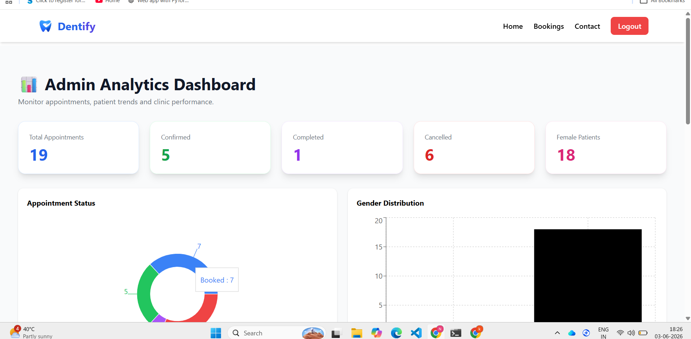
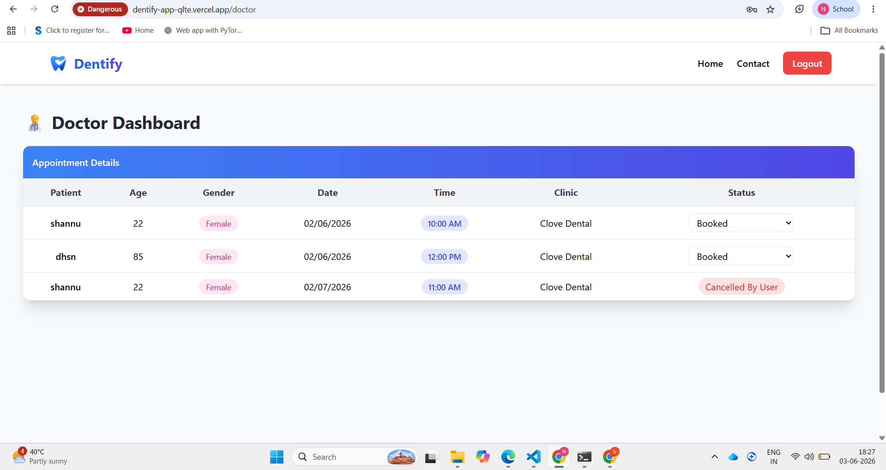
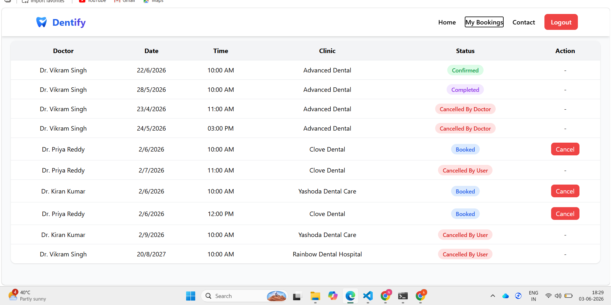

# 🦷 Dentist Appointment Booking Platform

---

## 📌 Description

### 🦷 Dentist Appointment Booking Platform

A full-stack MERN application that streamlines the process of discovering dentists and scheduling appointments online. The platform provides dedicated dashboards for Users, Doctors, and Admins, enabling efficient appointment management throughout the entire appointment lifecycle. Users can browse dentists, search by name, and book appointments, while doctors can manage appointment statuses and track patient bookings. The system includes JWT-based authentication, role-based access control, duplicate slot booking prevention, appointment lifecycle management, analytics dashboards, and a responsive user interface built with React and Tailwind CSS. The application is deployed using Vercel and Render, with MongoDB used for secure data storage.

---

## 🚀 Live Demo

🌐 Frontend: https://dentify-app-qlte.vercel.app/
🔗 Backend:  https://dentify-app-60p9.onrender.com
💻 GitHub: https://github.com/Khadarbeesk/Dentify-App

---

## 📸 Screenshots

## 📄 Pages & UI Preview

### 🏠 Home Page

### 🧑‍⚕️ Doctors Listing

### 🛠️ Admin Dashboard

### 🛠️ Doctor Dashboard

### 🧑‍⚕️ User Dashboard

---

## 💡 Key Highlights
💡 Key Highlights
* Full-Stack MERN Application
* JWT-Based Authentication
* Role-Based Access Control (User / Doctor / Admin)
* Responsive UI with Tailwind CSS
* Appointment Booking & Management
* Admin Analytics Dashboard with Charts
* Doctor Dashboard for Appointment Management
* Pagination and Search Functionality
* Deployed on Vercel and Render
* Fully responsive design (mobile + desktop)
🕒 Duplicate Slot Booking Prevention
* Prevents multiple patients from booking the same dentist, date, and time slot.
🔄 Appointment Lifecycle Management
* Complete appointment workflow from booking to completion.
* Appointment statuses include:
     * Booked
     * Confirmed
     * Completed
     * Cancelled by User
     * Cancelled by Doctor
* Status updates are reflected across User, Doctor, and Admin dashboards in real time.

---

## 📌 Features

### 👤 User Features

* Browse dentists
* Search dentists by name
* View dentist details
* Book appointments
* View personal appointments
* Responsive design
* Duplicate Slot Booking Prevention

### 🛠️ Admin Features
* Secure Admin Login
* View all appointments
* Analytics Dashboard
* Appointment Status Overview
* Patient Gender Distribution Charts

### 🛠️ Doctor Features

Doctor Login
*  View assigned appointments
*  Confirm appointments
*  Mark appointments as completed
*  Cancel appointments when necessary
### 🔐 Authentication

User Registration & Login
* Doctor Login
* Admin Login
* JWT Authentication
* Protected Routes
* Role-Based Authorization
---

## 🧰 Tech Stack

### Frontend

* React.js
* Tailwind CSS
* React Router DOM
* Fetch API
* Recharts

### Backend

* Node.js
* Express.js
* MongoDB (Mongoose)
* JWT Authentication
* RESTful API

### Deployment

* Frontend → Netlify
* Backend → Render

## 📡 API Endpoints

### 🔐 Authentication

POST /api/auth/register

POST /api/auth/login

### 🦷 Dentists

GET /api/dentists

POST /api/dentists

### 📅 Appointments

POST /api/appointments

GET /api/appointments

GET /api/appointments/my

GET /api/appointments/doctor

GET /api/appointments/slots

PUT /api/appointments/cancel/:id

PUT /api/appointments/doctor/:id/status

## ⚙️ Installation & Setup

### 🔐 Environment Variables

Create a `.env` file in backend and add:

MONGO_URI=your_mongodb_connection
JWT_SECRET=your_secret_key
PORT=5000

### Clone Repository

git clone https://github.com/Khadarbeesk/dentist-app.git

### Backend Setup

cd backend
npm install
node server.js

### Frontend Setup

cd frontend
npm install
npm start

---

## 🔒 Security

* Passwords are securely hashed
* JWT tokens used for authentication
* Protected routes for admin access

---

## 🔑 Demo Credentials

**Admin Login**
Email: [admin@gmail.com](mailto:admin@gmail.com)
Password: 1234

**Doctor Login**
Email: [priya@gmail.com](mailto:priya@gmail.com)
Password: 123456

---

## ⚠️ Important Note

Admin credentials are pre-defined for demo purposes.
Users cannot self-register as admin.

---

## 🚀 Future Improvements

* Online Payments
* Email Notifications
* SMS Notifications
* Appointment Rescheduling
* Doctor Availability Calendar
* Patient Medical History
* Video Consultation Support

---

## 👨‍💻 Author

**Khadarbee Shaik**